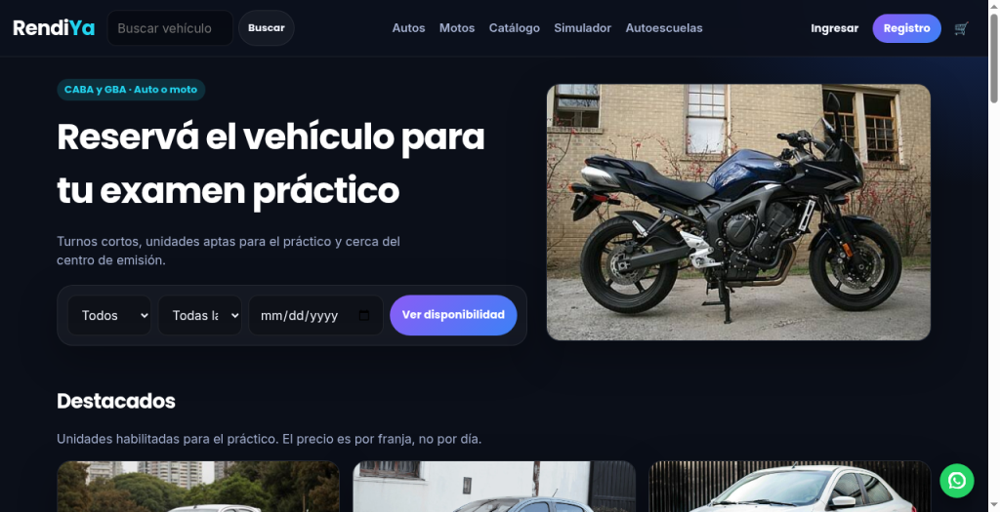
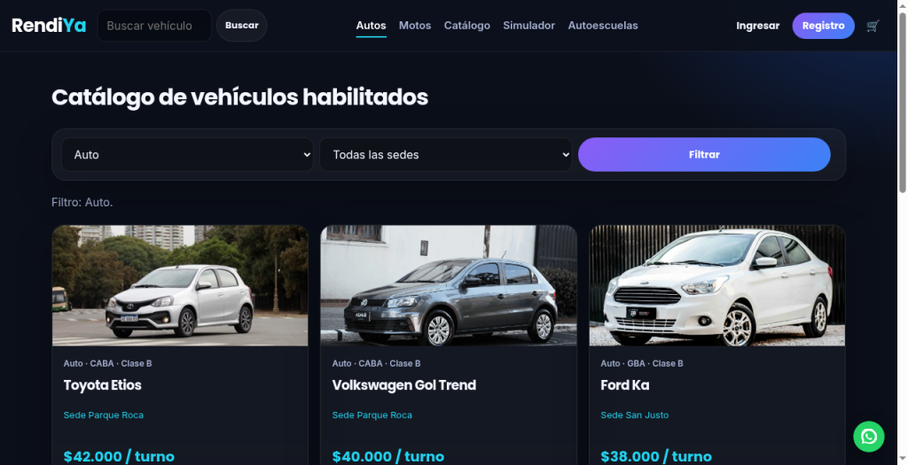
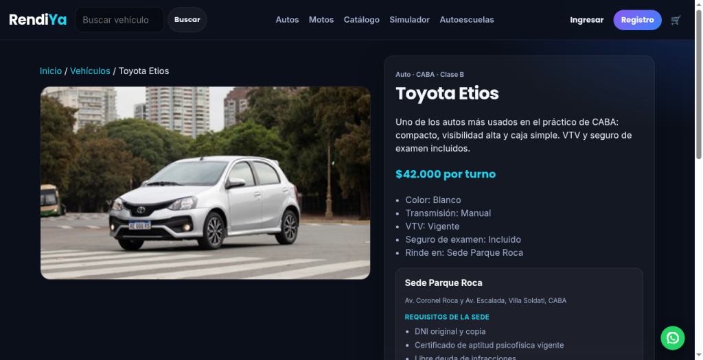
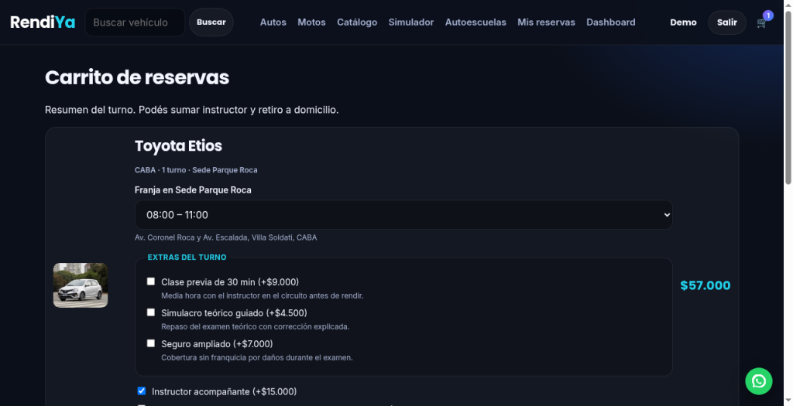
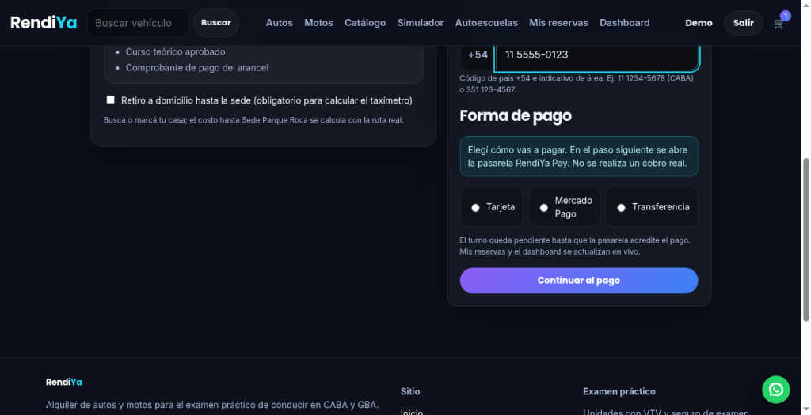
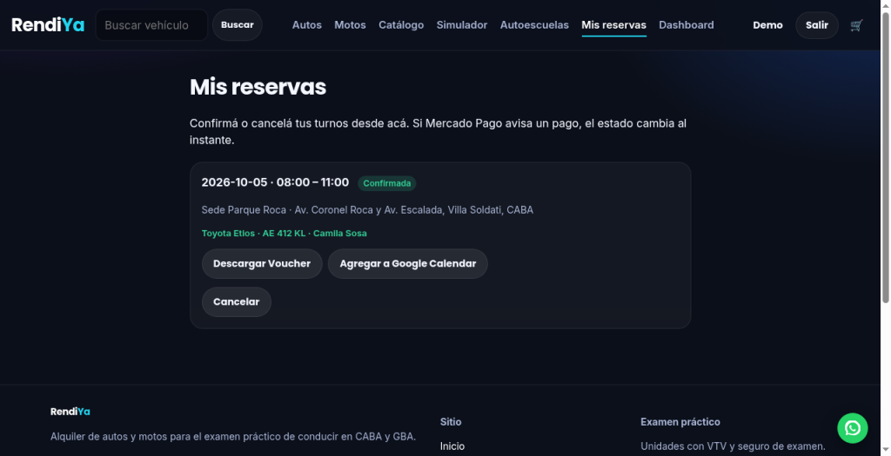
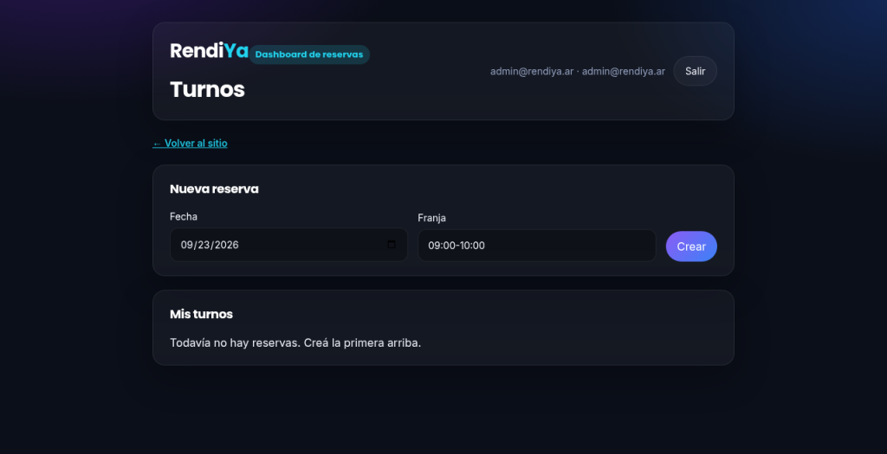

# RendiYa

**Book a licensed vehicle for your driving test — by time slot, not by the day.**

RendiYa is a full-stack booking platform for people taking the practical driving exam in Buenos Aires (CABA and GBA). Traditional rentals are priced per day and are not coordinated with test centers. This product sells a **short slot with a suitable car or motorcycle**, close to the licensing office, with inspection (VTV) and exam insurance included.

| Storefront | Reservations API | Operations dashboard |
| --- | --- | --- |
| [mauroacarbone/rendiya](https://github.com/mauroacarbone/rendiya) | [mauroacarbone/rendiya-api](https://github.com/mauroacarbone/rendiya-api) | [mauroacarbone/rendiya-dashboard](https://github.com/mauroacarbone/rendiya-dashboard) |

This repository is the **customer-facing storefront**: catalog, checkout, accounts, and self-service bookings.

## Live demo

| | URL |
| --- | --- |
| Storefront | [rendiya.onrender.com](https://rendiya.onrender.com) |
| Reservations API | [rendiya-api.onrender.com](https://rendiya-api.onrender.com) |
| Operations dashboard | [rendiya-dashboard.onrender.com](https://rendiya-dashboard.onrender.com) |

Test accounts are listed in [Credenciales de Prueba](#credenciales-de-prueba).

Free Render instances sleep after idle time; the first request can take about a minute. SQLite on the free tier is ephemeral, so catalog and users are re-seeded when the instance is recreated.

## Screenshots

Happy path on the live storefront: home, catalog, product, checkout, payment, reservations, and the admin dashboard.

**Home** — Página de inicio de RendiYa con propuesta de valor, buscador de disponibilidad y vehículos destacados.



**Catalog** — Catálogo filtrado por autos, con vehículos visibles, sedes y precios por turno.



**Product** — Ficha del Toyota Etios con imagen, características, requisitos de sede y precio.



**Checkout** — Carrito con Toyota Etios, fecha y franja 08:00–11:00 seleccionadas, más instructor acompañante.



**Payment** — Formulario de checkout con WhatsApp completado y opciones de forma de pago visibles.



**Reservations** — Mis reservas mostrando el turno confirmado del Toyota Etios en Sede Parque Roca.



**Admin** — Dashboard de reservas abierto con sesión de administrador y formulario de nueva reserva.



---

## Credenciales de Prueba

These accounts are created by the seeds on every boot (`src/database/seed.js`), both locally and on Render. `ensureDemoAccounts()` resets the demo passwords and roles on each start, so they always work even if someone changed them.

| Role | Email | Password | Use it to |
| --- | --- | --- | --- |
| Customer | `demo@rendiya.ar` | `demo1234` | Book a vehicle (cart → checkout → payment), run the theory simulator, manage **My reservations** |
| Admin | `admin@rendiya.ar` | `demo1234` | Everything above, plus fleet CRUD, the user list, and **Leads Autoescuelas** in `/central` |
| Admin (seed owner) | `mauro@rendiya.ar` | `rendiya2026` | Same as Admin; created only when the database is empty |

**Trying the B2B lead flow**

1. Open `/autoescuelas` (no login needed) and submit **Registrar mi autoescuela**.
2. Sign in as `admin@rendiya.ar` and open `/central/leads`.
3. Use **Contactar** (opens WhatsApp and marks the lead as contacted), **Aprobar y Publicar** (the school appears in `/autoescuelas`), or **Descartar** (hides it again).

The customer account gets `403` from the admin lead endpoints.

---

## Problem and approach

Candidates often pass the theory exam but do not have a vehicle that meets test-center rules. RendiYa treats each listing as a **bookable slot** (vehicle + zone + time window), with an optional instructor add-on.

Customers complete the flow on the website. Admins manage the fleet. An operations dashboard is available for staff; it is not required to confirm a booking.

---

## Features

- Filterable catalog (car / motorcycle, CABA / GBA, search)
- Single-slot cart with optional instructor
- Checkout with date and time window; the booking is **confirmed** on submit
- **My reservations**: list, confirm pending slots, and cancel — on the storefront
- Role-based access: fleet CRUD and user directory for **admins only**
- Session auth (bcrypt, remember-me cookie) with server- and client-side validation
- JSON APIs for users and products (`/api/users`, `/api/products`)
- Driving-school directory (`/autoescuelas`) with WhatsApp contact, B2B lead capture, and admin approval in `/central`
- Cross-sell modal after the theory simulator and the directory, pointing to the practical-exam booking
- Syncs the logged-in user with **rendiya-api** (JWT) so reservations persist in the booking service

---

## Architecture

```text
Browser  →  Express + EJS storefront (:3000)
                 │
                 ├─ SQLite / MySQL (catalog, users, session)
                 │
                 └─ rendiya-api (:3001)  JWT REST  →  reservations
                              ▲
                              │
                    rendiya-dashboard (:5173)
                    staff console (React + Vite)
```

| Layer | Choice |
| --- | --- |
| Runtime | Node.js 20+, Express 5 |
| Views | EJS, custom CSS (Poppins / Inter) |
| Storefront data | Sequelize; SQLite in development, MySQL when `DB_HOST` is set |
| Auth | express-session, cookies, bcryptjs |
| Bookings | JWT REST — [rendiya-api](https://github.com/mauroacarbone/rendiya-api) |
| Ops UI | [rendiya-dashboard](https://github.com/mauroacarbone/rendiya-dashboard) |

---

## Local setup

**Prerequisite:** Node.js 20+.

The storefront uses SQLite locally; MySQL is not required.

### 1. Storefront — port 3000

```bash
cp .env.example .env
npm install
npm run dev
```

Open [http://localhost:3000](http://localhost:3000).

### 2. Reservations API — port 3001

Clone [rendiya-api](https://github.com/mauroacarbone/rendiya-api), copy `.env.example`, then:

```bash
npm install
npm run swagger
npm run dev
```

The catalog works without the API. Confirming a booking requires it.

### 3. Dashboard — port 5173 (optional)

Clone [rendiya-dashboard](https://github.com/mauroacarbone/rendiya-dashboard):

```bash
cp .env.example .env.local
npm install
npm run dev
```

Storefront environment (`.env`):

```env
RENDIYA_API_URL=http://localhost:3001
DASHBOARD_URL=http://localhost:5173
SESSION_SECRET=replace-with-a-long-random-string
NODE_ENV=development
```

### Demo accounts

See [Credenciales de Prueba](#credenciales-de-prueba). Sign-in and registration sync the user to the reservations API.

The built-in admin panel is served at `/central` after `npm run central` (builds `dashboard/`). In development you can also run `npm --prefix dashboard run dev` on port 5173; it proxies `/api` to port 3000 and uses the same login session.

---

## Main routes

| Path | Access |
| --- | --- |
| `/`, `/products`, `/products/:id` | Public catalog |
| `/products/cart`, `/products/checkout` | Booking |
| `/users/register`, `/users/login`, `/users/profile` | Account |
| `/users/reservations` | Authenticated bookings |
| `/products/create`, `/products/baja` | Admin fleet |
| `/users` | Admin user list |
| `/simulador` | Public theory-exam simulator |
| `/autoescuelas` | Public driving-school directory and B2B sign-up form |
| `/central`, `/central/leads` | Admin panel (leads require an admin session) |
| `GET /api/users`, `GET /api/products` | JSON |
| `GET /api/autoescuelas?zona=&barrio=` | JSON, public (published schools only) |
| `GET /api/autoescuelas/leads` | JSON, admin session |
| `PATCH /api/autoescuelas/leads/:id` `{ "status": "new" \| "contacted" \| "approved" \| "rejected" }` | JSON, admin session; `approved` publishes the school, any other status unpublishes it |

---

## Deployment

Free [Render](https://render.com) Hobby workspace (no card required for static + free web). Order: **API → storefront → dashboard**.

1. Connect GitHub and create a **Web Service** from `mauroacarbone/rendiya-api` (Free instance). Wait until `https://rendiya-api.onrender.com` answers.
2. Create a **Web Service** from `mauroacarbone/rendiya`. Set `RENDIYA_API_URL` to that API origin (no trailing slash) and `DASHBOARD_URL` after step 3 (you can redeploy).
3. Create a **Static Site** from `mauroacarbone/rendiya-dashboard`. Build-time env: `VITE_API_URL=https://rendiya-api.onrender.com/api` and `VITE_SITE_URL` = the storefront URL. Redeploy the storefront with `DASHBOARD_URL`.

`STOREFRONT_SECRET` must match on API and storefront (`rendiya-storefront-live` in each `render.yaml`).

Free web services sleep after ~15 minutes idle; the first hit can take about a minute. SQLite on Render is ephemeral (data resets if the instance is recreated).

---

## Repository layout

```text
src/
  app.js
  controllers/          # pages and /api JSON
  routes/
  views/                # EJS templates
  database/             # Sequelize models and seed
  middlewares/
  services/rendiyaApi.js
public/                 # CSS, client JS, images
```

On boot the app runs `sequelize.sync` and seeds an empty database.

Wireframes and early brand work live in [`wireframes/`](wireframes/) and [`design/`](design/).

---

## Author

**Mauro Carbone** — Full Stack developer.

RendiYa started as a Digital House capstone and is maintained as a three-service product (storefront, API, operations dashboard).
